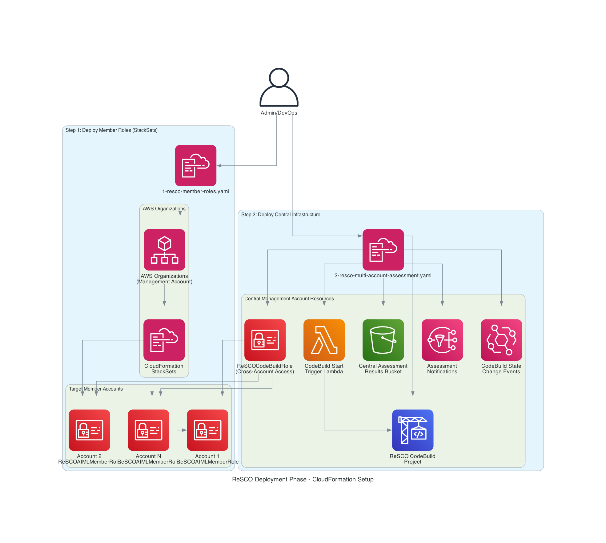
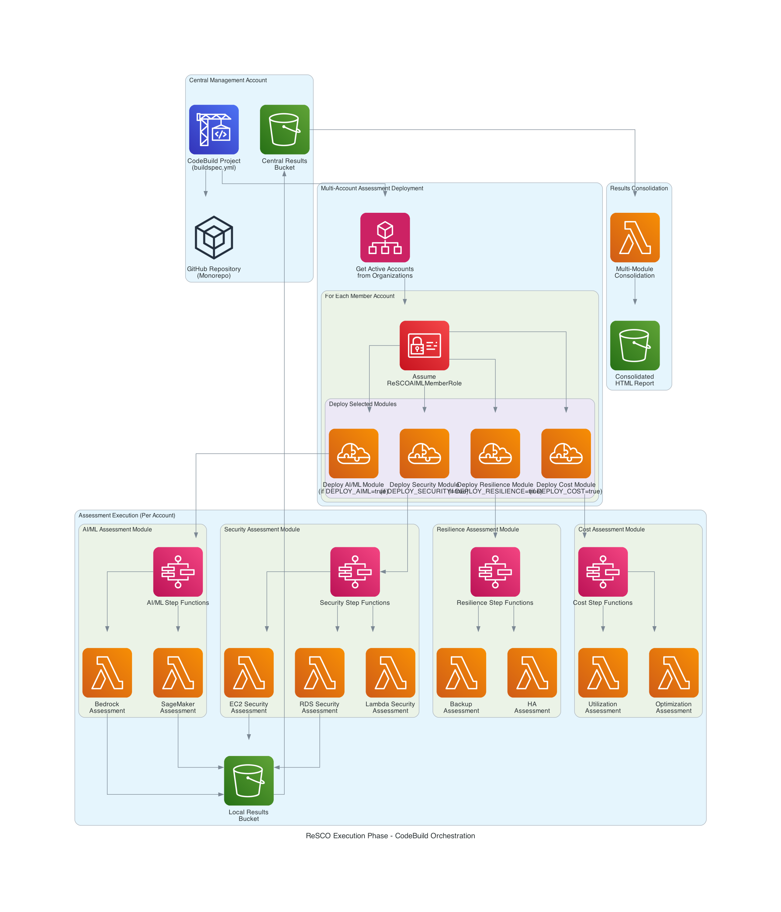
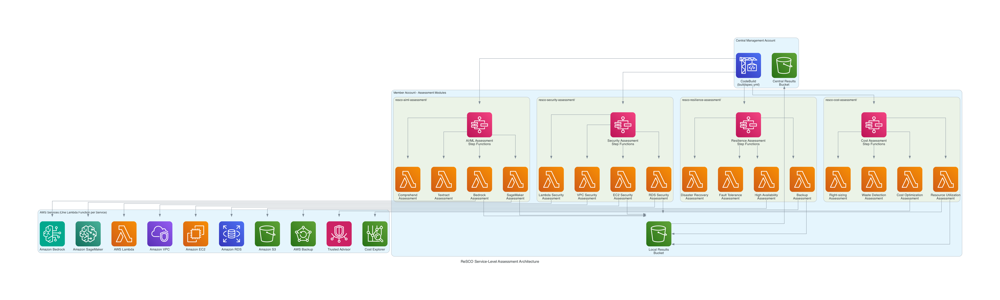

# ReSCO Assessment Framework - Developer Guide

## Architecture Overview

The ReSCO (Resilience, Security, and Cost Optimization) Assessment Framework is a modular, serverless, multi-account solution built on AWS. The framework is organized into separate assessment modules, each focusing on a specific dimension of AWS workload evaluation.

## Architecture Diagrams

### Phase 1: Deployment Setup (CloudFormation)


### Phase 2: Assessment Execution (CodeBuild)


### Service-Level Assessment Architecture


## Two-Phase Architecture

### Phase 1: Infrastructure Deployment

#### Step 1: Member Account Roles (`1-resco-member-roles.yaml`)
- **StackSets Deployment**: Deploys `ReSCOAIMLMemberRole` to all target accounts
- **Cross-Account Trust**: Establishes trust relationship with central management account
- **Assessment Permissions**: Grants read-only access to AWS services for assessment

#### Step 2: Central Infrastructure (`2-resco-multi-account-assessment.yaml`)
- **CodeBuild Project**: Orchestrates multi-account deployments and assessments
- **S3 Bucket**: Central storage for consolidated assessment results
- **IAM Role**: `ReSCOCodeBuildRole` with cross-account access permissions
- **SNS Topic**: Optional email notifications for assessment completion
- **EventBridge Rules**: Automated workflow triggers
- **Lambda Trigger**: Automatically starts CodeBuild after stack creation

### Phase 2: Assessment Execution (CodeBuild Orchestration)

#### CodeBuild Execution Flow
1. **Account Discovery**: Lists active accounts from AWS Organizations
2. **Role Assumption**: Assumes `ReSCOAIMLMemberRole` in each target account
3. **Module Deployment**: Conditionally deploys selected assessment modules
4. **Assessment Execution**: Triggers Step Functions for each deployed module
5. **Results Consolidation**: Collects and consolidates results from all accounts

#### Assessment Modules (Monorepo Structure)
```
resco-assessments/
├── resco-aiml-assessment/          # AI/ML services (Bedrock, SageMaker)
├── resco-security-assessment/      # General security assessments
├── resco-resilience-assessment/    # DR, backup, fault tolerance
├── resco-cost-assessment/          # Cost optimization assessments
└── deployment/                     # Shared deployment templates
```

#### Member Account Resources (Deployed by CodeBuild)
- **SAM Applications**: Multiple assessment modules deployed conditionally
- **Step Functions**: One workflow per assessment module (AI/ML, Security, Resilience, Cost)
- **Lambda Functions**: One function per AWS service assessment
- **Local S3 Bucket**: Temporary storage for account-specific results

### Assessment Execution Workflow

#### CodeBuild Orchestration
```bash
# buildspec.yml execution flow
1. Get active accounts from Organizations
2. For each account:
   - Assume ReSCOAIMLMemberRole
   - Deploy selected assessment modules
   - Start Step Functions execution
3. Wait for completion and consolidate results
```

#### Step Functions (Per Module)
```json
{
  "Comment": "AI/ML Assessment Module",
  "StartAt": "Parallel Service Assessments",
  "States": {
    "Parallel Service Assessments": {
      "Type": "Parallel",
      "Branches": [
        {"StartAt": "Bedrock Assessment", "States": {...}},
        {"StartAt": "SageMaker Assessment", "States": {...}}
      ]
    },
    "Generate Module Report": "..."
  }
}
```

## Assessment Module Structure 

### 1. AI/ML Assessment (`resco-aiml-assessment/`)
- **Bedrock Assessment Lambda**: Guardrails, Logging, VPC Endpoints, IAM Roles
- **SageMaker Assessment Lambda**: Notebooks, Domains, Training Jobs, Model Registry
- **Comprehend Assessment Lambda**: Data privacy, Access controls (Future)
- **Textract Assessment Lambda**: Document processing security (Future)

### 2. Security Assessment (`resco-security-assessment/`)
- **Planned**

### 3. Resilience Assessment (`resco-resilience-assessment/`)
- **Planned**

### 4. Cost Assessment (`resco-cost-assessment/`)
- **Planned**

## Adding New Assessment Services

### Step 1: Choose Assessment Module

Determine which module your new service belongs to:
- **AI/ML services** → `resco-aiml-assessment/`
- **General security** → `resco-security-assessment/`
- **Resilience/DR** → `resco-resilience-assessment/`
- **Cost optimization** → `resco-cost-assessment/`

### Step 2: Create Service Assessment Function

1. **Create Function Directory** (One function per service):
```bash
# Example: Adding EKS security assessment
mkdir -p resco-security-assessment/functions/security/eks_assessment
cd resco-security-assessment/functions/security/eks_assessment
```

2. **Create Function Files**:
```python
# app.py
import boto3
import json
from schema import create_finding

def lambda_handler(event, context):
    """Main assessment handler for new service"""
    all_findings = []
    
    # Get cached permissions
    execution_id = event["Execution"]["Name"]
    permission_cache = get_permissions_cache(execution_id)
    
    # Run assessment checks
    findings = check_new_service_security(permission_cache)
    all_findings.append(findings)
    
    # Generate and upload report
    csv_content = generate_csv_report(all_findings)
    bucket_name = os.environ.get('AIML_ASSESSMENT_BUCKET_NAME')
    s3_url = write_to_s3(execution_id, csv_content, bucket_name)
    
    return {
        'statusCode': 200,
        'body': {
            'message': 'New service assessment completed',
            'findings': all_findings,
            'report_url': s3_url
        }
    }

def check_new_service_security(permission_cache):
    """Implement your security checks here"""
    findings = {
        'check_name': 'New Service Security Check',
        'status': 'PASS',
        'details': '',
        'csv_data': []
    }
    
    # Your assessment logic here
    # Use permission_cache to check IAM permissions
    # Use AWS SDK to check service configurations
    
    return findings
```

3. **Create Requirements File**:
```txt
# requirements.txt
boto3>=1.26.0
botocore>=1.29.0
```

4. **Create Schema File**:
```python
# schema.py
def create_finding(finding_name, finding_details, resolution, reference, severity, status):
    """Create standardized finding format"""
    return {
        'Finding': finding_name,
        'Finding_Details': finding_details,
        'Resolution': resolution,
        'Reference': reference,
        'Severity': severity,
        'Status': status
    }
```

### Step 3: Update SAM Template

Add your new function to the appropriate module's `template.yaml`:

**For Security Assessment** (`resco-security-assessment/template.yaml`):

```yaml
  NewServiceSecurityAssessmentFunction:
    Type: AWS::Serverless::Function
    Properties:
      FunctionName: NewServiceSecurityAssessment
      CodeUri: functions/security/new_service_assessments/
      Handler: app.lambda_handler
      Runtime: python3.12
      Timeout: 600
      MemorySize: 1024
      Environment:
        Variables:
          AIML_ASSESSMENT_BUCKET_NAME: !Ref AIMLAssessmentBucket
      Policies:
        - S3CrudPolicy:
            BucketName: !Ref AIMLAssessmentBucket
        - Statement:
            - Sid: NewServicePermissions
              Effect: Allow
              Action:
                - newservice:List*
                - newservice:Describe*
                - newservice:Get*
              Resource: '*'
```

### Step 4: Update Step Functions Definition

Add new service to the module's parallel execution:

**For Security Assessment** (`resco-security-assessment/statemachine/security_assessments.asl.json`):

```json
{
  "Parallel Service Assessments": {
    "Type": "Parallel",
    "Branches": [
      {
        "StartAt": "EC2 Security Assessment",
        "States": {"EC2 Security Assessment": {"Type": "Task", "Resource": "arn:aws:states:::lambda:invoke", "End": true}}
      },
      {
        "StartAt": "RDS Security Assessment",
        "States": {"RDS Security Assessment": {"Type": "Task", "Resource": "arn:aws:states:::lambda:invoke", "End": true}}
      },
      {
        "StartAt": "EKS Security Assessment",
        "States": {"EKS Security Assessment": {"Type": "Task", "Resource": "arn:aws:states:::lambda:invoke", "End": true}}
      }
    ]
  }
}
```

### Step 5: Update Buildspec Configuration

Add deployment logic to `buildspec.yml`:

```bash
# Add environment variable for new assessment type
DEPLOY_SECURITY_ASSESSMENT=${DEPLOY_SECURITY_ASSESSMENT:-false}

# Add conditional deployment logic
if [[ $DEPLOY_SECURITY_ASSESSMENT = 'true' ]]; then
  echo "Deploying Security Assessment"
  cd resco-security-assessment
  sam build --use-container
  sam deploy --template-file .aws-sam/build/template.yaml \
    --stack-name resco-security-$accountId \
    --capabilities CAPABILITY_IAM \
    --parameter-overrides BucketName=$BUCKET_REPORT
fi
```

### Step 6: Update IAM Permissions

Add required permissions to both member role templates:

**In `deployment/1-resco-member-roles.yaml`**:
```yaml
- Effect: Allow
  Action:
    - newservice:List*
    - newservice:Describe*
    - newservice:Get*
  Resource: '*'
```

**In `deployment/2-resco-multi-account-assessment.yaml`** (for single account mode):
```yaml
- newservice:List*
- newservice:Describe*
- newservice:Get*
```

## Assessment Best Practices

### 1. Security Check Implementation
- **Use Cached Permissions**: Always use the IAM permission cache to avoid API throttling
- **Handle Exceptions**: Implement proper error handling and logging
- **Follow Least Privilege**: Only request necessary permissions
- **Standardize Findings**: Use the `create_finding()` function for consistent output

### 2. Performance Optimization
- **Batch API Calls**: Use pagination and batch operations where possible
- **Implement Retries**: Use exponential backoff for AWS API calls
- **Cache Results**: Store intermediate results to avoid redundant API calls
- **Set Appropriate Timeouts**: Configure Lambda timeout based on assessment complexity

### 3. Error Handling
```python
try:
    # Assessment logic
    result = aws_client.describe_service()
except ClientError as e:
    if e.response['Error']['Code'] == 'AccessDenied':
        # Handle permission issues
        logger.warning(f"Access denied for service check: {str(e)}")
        return create_finding(
            finding_name="Permission Check",
            finding_details="Insufficient permissions to assess service",
            resolution="Grant required permissions to assessment role",
            reference="https://docs.aws.amazon.com/service/permissions",
            severity='High',
            status='Failed'
        )
    else:
        # Handle other AWS errors
        logger.error(f"AWS API error: {str(e)}")
        raise
except Exception as e:
    # Handle unexpected errors
    logger.error(f"Unexpected error: {str(e)}", exc_info=True)
    raise
```

## Testing Your Extensions

### 1. Local Testing
```bash
# Test individual function
cd resco-aiml-assessment
sam build
sam local invoke NewServiceSecurityAssessmentFunction --event test-event.json
```

### 2. Integration Testing
```bash
# Deploy to test account
sam deploy --stack-name resco-test --capabilities CAPABILITY_IAM

# Execute Step Functions
aws stepfunctions start-execution \
  --state-machine-arn arn:aws:states:region:account:stateMachine:TestStateMachine \
  --input '{"accountId":"123456789012"}'
```

### 3. Multi-Account Testing
1. Deploy member roles to test accounts using StackSets
2. Deploy central infrastructure with test parameters
3. Monitor CodeBuild logs for deployment and execution status
4. Verify results in central S3 bucket

## Deployment Process

### Prerequisites
- AWS Organizations setup with management account access
- StackSets service-linked roles configured
- Appropriate permissions for CloudFormation deployment

### Step-by-Step Deployment

#### Step 1: Deploy Member Roles (StackSets)
```bash
# Deploy 1-resco-member-roles.yaml via StackSets
aws cloudformation create-stack-set \
  --stack-set-name resco-aiml-member-roles \
  --template-body file://1-resco-member-roles.yaml \
  --parameters ParameterKey=ReSCOAccountID,ParameterValue=123456789012 \
  --capabilities CAPABILITY_NAMED_IAM
```

#### Step 2: Deploy Central Infrastructure
```bash
# Deploy 2-resco-multi-account-assessment.yaml
aws cloudformation create-stack \
  --stack-name resco-aiml-multi-account \
  --template-body file://2-resco-multi-account-assessment.yaml \
  --parameters \
    ParameterKey=MultiAccountScan,ParameterValue=true \
    ParameterKey=DEPLOY_AIML_ASSESSMENT,ParameterValue=true \
  --capabilities CAPABILITY_NAMED_IAM
```

#### Step 3: Assessment Execution (Automatic)
- CodeBuild project starts automatically after stack creation
- Lambda trigger initiates the assessment process
- Results are consolidated in central S3 bucket

### Configuration Options

#### Assessment Module Selection
```bash
# Environment variables for module deployment
DEPLOY_AIML_ASSESSMENT=true
DEPLOY_SECURITY_ASSESSMENT=false
DEPLOY_RESILIENCE_ASSESSMENT=false
DEPLOY_COST_ASSESSMENT=false
```

#### Account Targeting
- **All Accounts**: Leave `MultiAccountListOverride` blank
- **Specific Accounts**: Set `MultiAccountListOverride="123456789012 234567890123"`
- **Single Account**: Set `MultiAccountScan=false`

## Monitoring and Troubleshooting

### CloudWatch Logs
- **CodeBuild Logs**: `/aws/codebuild/ReSCOCodeBuild`
- **Lambda Logs**: `/aws/lambda/[FunctionName]`
- **Step Functions**: View execution history in console

### Common Issues
1. **Permission Errors**: Check IAM roles and trust relationships
2. **Timeout Issues**: Increase Lambda timeout or optimize code
3. **API Throttling**: Implement exponential backoff and retries
4. **Cross-Account Access**: Verify role assumption and trust policies

### Debugging Tips
```python
# Enable debug logging
import logging
logger = logging.getLogger()
logger.setLevel(logging.DEBUG)

# Log assessment progress
logger.info(f"Starting assessment for account: {account_id}")
logger.debug(f"Found {len(resources)} resources to assess")
```

## Contributing

We welcome community contributions! Please see [CONTRIBUTING.md](CONTRIBUTING.md) for guidelines.

## Security
- All roles follow least-privilege principle
- Cross-account trust limited to specific CodeBuild role
- S3 bucket enforces SSL-only access
- Assessment data encrypted in transit and at rest
- No persistent credentials stored in CodeBuild

See [Security issue notifications](CONTRIBUTING.md#security-issue-notifications) for more information.

## Module Development Roadmap

### Current Status
- ✅ **AI/ML Assessment**: Bedrock Lambda, SageMaker Lambda (Active)
- 🚧 **Security Assessment**:  Planned
- 📋 **Resilience Assessment**: Planned
- 📋 **Cost Assessment**: Planned

### Service-Level Development Pattern
- Each AWS service gets its own dedicated Lambda function
- Step Functions orchestrates parallel execution of service assessments
- Results are consolidated at the module level
- Buildspec orchestrates module deployment across accounts

## Support and Resources

### Documentation
- [AWS Well-Architected Framework](https://aws.amazon.com/architecture/well-architected/)
- [AWS Security Best Practices](https://aws.amazon.com/security/security-resources/)
- [AWS SAM Developer Guide](https://docs.aws.amazon.com/serverless-application-model/)

---

This developer guide provides the foundation for extending the ReSCO Assessment Framework. As you add new services and capabilities, please update this documentation to help future contributors understand and build upon your work.