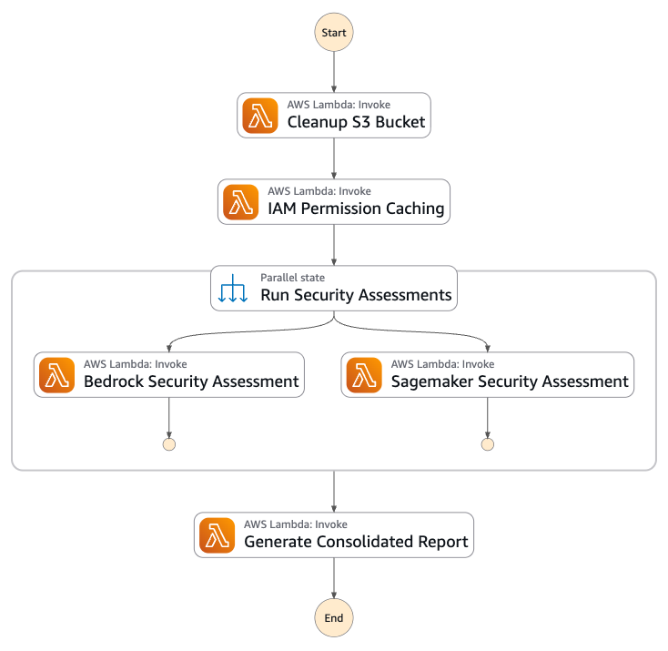

# ReSCO AI/ML Assessment Framework

## Overview
ReSCO AI/ML Assessment Framework is a serverless solution designed to perform comprehensive Resilience, Security, and Cost Optimization (ReSCO) assessments for AI/ML workloads on AWS. The initial release focuses on security assessments for Amazon Bedrock and Amazon SageMaker workloads.


## Features

### Current Features
Security Assessments for:
- **Amazon Bedrock**
  - Network Isolation
  - Data Protection
  - Identity and Access Management
- **Amazon SageMaker**
  - Compute and network isolation
  - Authentication and authorization
  - Data protection
  - Governance and Auditability

## Prerequisites
- AWS Account with appropriate permissions
- Python 3.12+ - [Install Python](https://www.python.org/downloads/)
- SAM CLI - [Install the SAM CLI](https://docs.aws.amazon.com/serverless-application-model/latest/developerguide/serverless-sam-cli-install.html)
- Docker - [Install Docker community edition](https://hub.docker.com/search/?type=edition&offering=community)

## Installation
Please refer to the [main repository README.md](../README.md) for complete installation and deployment instructions.

## Project Structure
```
resco-aiml-assessment/
├── template.yaml               # SAM template
├── functions/
│   ├── security/ 
│       ├── bedrock/              # Bedrock assessment functions
│       ├── sagemaker/            # SageMaker assessment functions
└── statemachine/                 # Contains the state machine definition
```

## Step Functions Workflow


## References
- [AWS Security Best Practices](https://docs.aws.amazon.com/security/)
- [Amazon Bedrock Security](https://docs.aws.amazon.com/bedrock/latest/userguide/security.html)
- [Amazon SageMaker Security](https://docs.aws.amazon.com/sagemaker/latest/dg/security.html)
- [AWS SAM Developer Guide](https://docs.aws.amazon.com/serverless-application-model/latest/developerguide/what-is-sam.html)
